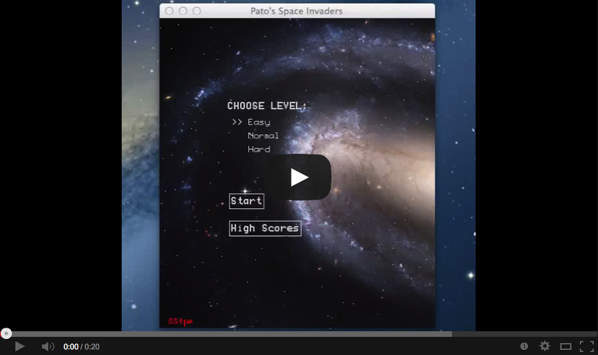

This is Patricio Cubillos' implementation of Space Invaders.

Version:
--------
1.0.0

<dl >
  .
  .
  
</dl>

Youtube demo:

Info:
-----
The game comes with three levels of difficulty, it gets harder as you advance the stages, the player can grab special weapons as you kill aliens, The best socres are stored for each difficulty. The source code can be downloaded from the repository:
https://github.com/pcubillos/space-invaders

No rights are reserved, you are free to  build upon my code and make your own version. All resources (font, image, sounds) were obtained freely from the internet.

System requirements:
--------------------
Python (http://www.python.org/) and Pygame (http://www.pygame.org/docs/).

Play:
-----
To start playing, simply open your terminal, go to the directory where the game is located, and type:
python space.py

Controls       Key
move left      left arrow
move right     rigt arrow
shoot          space bar
laser          x
cluster bomb   c

Latest actualization:
---------------------
01-November-2012.
